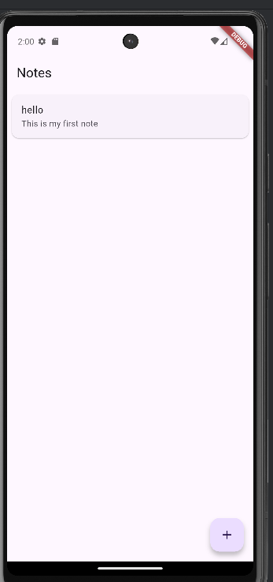
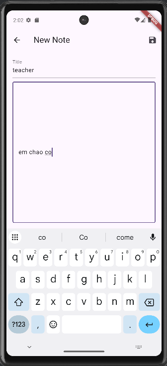
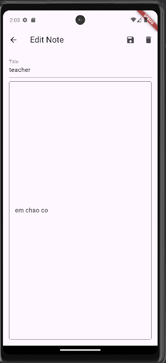
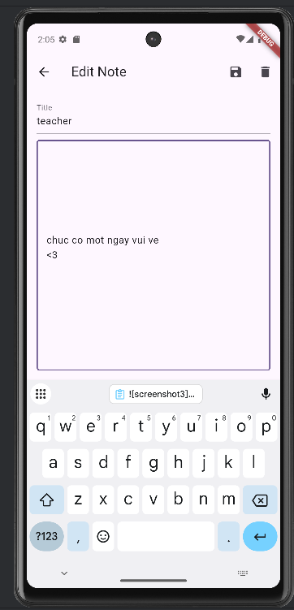
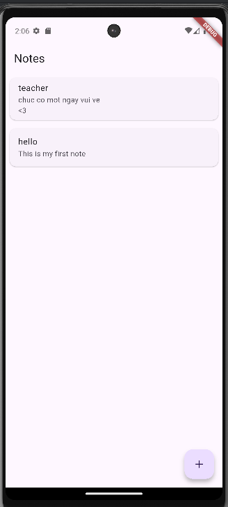
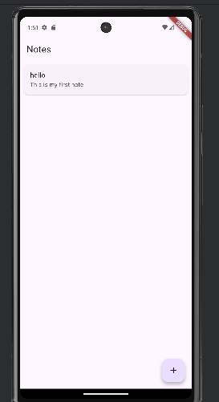

**Họ tên:** Dương Tuấn Kiệt
**MSSV:** 2224801030271

# Simple Note App
Ứng dụng ghi chú được xây dựng bằng Flutter – dùng để tạo, sửa, xem và lưu trữ ghi chú cục bộ bằng SQLite.

---

# Giới thiệu
Dự án này được phát triển theo yêu cầu bài tập thực hành Flutter, bao gồm:

- Tạo ghi chú
- Hiển thị danh sách ghi chú
- Chỉnh sửa ghi chú
- Lưu trữ ghi chú trong SQLite
- State management bằng Provider

---

**Cấu trúc Thư mục chính**
 lib
├── database
│ └── db_helper.dart
├── models
│ └── note.dart
├── providers
│ └── note_provider.dart
├── screens
│ ├── home_page.dart
│ └── note_editor_screen.dart
└── widgets
└── note_card.dart

---

 **Các chức năng đã hoàn thành**
✔ Hiển thị danh sách ghi chú  
✔ Tạo ghi chú mới  
✔ Chỉnh sửa ghi chú  
✔ Lưu trữ SQLite  
✔ State Management bằng Provider  
✔ Tự động cập nhật UI  

---

## 📸 **Giao diện ứng dụng**

**1️⃣ Màn hình danh sách ghi chú**

  

---

**2️⃣ Màn hình tạo ghi chú**

  

---

**3️⃣ Màn hình chỉnh sửa ghi chú**

  

  

  
 
---

**4️⃣ Giao diện danh sách sau khi xóa ghi chú**

  

  

---

**Thông tin nộp bài**
- Upload file `.zip` chứa thư mục **lib/**
- Gửi link GitHub repository
- Điền link GitHub vào Google Form của giảng viên

